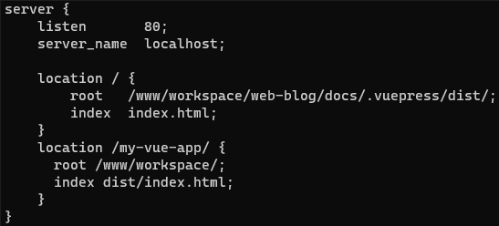
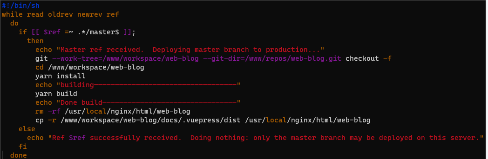
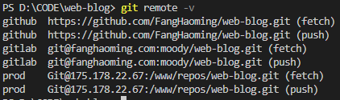

---
{
  "title": "CI/CD",
}
---

> 用腾讯云轻量应用服务器安装CentO S 7操作系统验证子路径部署、git自动化流程

## 子路径部署

①安装nginx [#](https://zhuanlan.zhihu.com/p/378409850)

`wget http://nginx.org/download/nginx-1.21.0.tar.gz`

`tar -xvf nginx-1.21.0.tar.gz`

`cd nginx-1.21.0 `

`./configure --prefix=/usr/local/nginx`

`make`

`make install`

#建立软链接

`ln -s /usr/local/nginx/sbin/nginx /usr/sbin/`

#启动

`nginx` 

#查看nginx是否成功启动

`ps -ef | grep nginx`

②**编辑nginx.conf**  

`vim /usr/local/nginx/conf/nginx.conf`

③**重新加载** 

`nginx -s reload`

④访问服务器ip/域名，输入正确端口号、路径，查看是否部署成功

[http://fanghaoming.com/](http://fanghaoming.com/)

[http://fanghaoming.com/my-vue-app/](http://fanghaoming.com/my-vue-app/)

## CI/CD

### 基于git hook的自动化流程

以项目`web-blog`为例：

①在构建机器上部署 git 并创建 Git 账户

②创建远程仓库 `git init --bare web-blog.git`

③编辑`web-blog.git/hooks`目录下的`post-receive` 并赋予执行权限 `chmod +x post-receive`

④在开发机器上添加部署源

⑤将代码推到构建机器

### 基于gitlab-runner的自动化流程

①安装gitlab

②安装并注册gitlab-runner