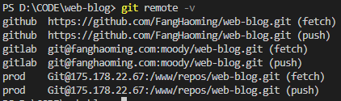

---
{
  "title": "CI/CD",
}
---

> 用腾讯云轻量应用服务器安装CentO S 7操作系统验证子路径部署、git自动化流程

## 子路径部署

#### ①安装nginx [#](https://zhuanlan.zhihu.com/p/378409850)

`wget http://nginx.org/download/nginx-1.21.0.tar.gz`

`tar -xvf nginx-1.21.0.tar.gz`

`cd nginx-1.21.0 `

`./configure --prefix=/usr/local/nginx`

`make`

`make install`

#建立软链接

`ln -s /usr/local/nginx/sbin/nginx /usr/sbin/`

#启动

`nginx` 

#查看nginx是否成功启动

`ps -ef | grep nginx`

#### ②编辑nginx.conf  

`vim /usr/local/nginx/conf/nginx.conf`


#### ③重新加载

`nginx -s reload`

#### ④访问服务器ip/域名，输入正确端口号、路径，查看是否部署成功

[http://fanghaoming.com/](http://fanghaoming.com/)

[http://fanghaoming.com/my-vue-app/](http://fanghaoming.com/my-vue-app/)

#### #其他

如果部署后路由以及静态资源不能正确访问，检查项目打包的静态资源路径，以vue-cli为例

- ##### 静态资源配置

  

- ##### 路由配置

  


## CI/CD

### 基于git hook的自动化流程


以项目`web-blog`为例：
#### ①在构建机器上部署 git 并创建 Git 账户

#### ②创建远程仓库 `git init --bare web-blog.git`

#### ③编辑`web-blog.git/hooks`目录下的`post-receive` 并赋予执行权限 `chmod +x post-receive`

```bash
#!/bin/sh
while read oldrev newrev ref
  do
    if [[ $ref =~ .*/master$ ]];
      then
        echo "Master ref received.  Deploying master branch to production..."
        git --work-tree=/www/workspace/web-blog --git-dir=/www/repos/web-blog.git checkout -f
        cd /www/workspace/web-blog
        yarn install
        echo "building——————————————————————————————————"
        yarn build
        echo "Done build————————————————————————————————"
        rm -rf /usr/local/nginx/html/web-blog
        cp -r /www/workspace/web-blog/docs/.vuepress/dist /usr/local/nginx/html/web-blog
    else
      echo "Ref $ref successfully received.  Doing nothing: only the master branch may be deployed on this server."
    fi
  done
```


#### ④在开发机器上添加部署源



#### ⑤将代码推到构建机器


### 基于gitlab-runner的自动化流程


#### ①安装gitlab [#](https://about.gitlab.com/install/#centos-7)

#### ②安装并注册gitlab-runner [#](https://docs.gitlab.com/runner/install/linux-repository.html)

#### ③编辑 `gitlab-ci.yaml`


#### ④推送代码到gitlab，验证pipeline


#### #其他

- ##### 在构建机器查看runner接收到的job


### #TODO

debug:  gitlab-runner: the service is not installed

验证公司runner

## 目标

- ~~基于 git hook 的自动化流程~~
  1. ~~保证网络连通性~~
  2. ~~在构建机器上部署 git 并创建 git 账户与 bare repository~~
  3. ~~配置 git-hook 与编写构建/部署脚本~~
  4. ~~配置开发机器的部署源~~

  - ~~基于 gitlab-runner 的自动化流程~~
    1. ~~按照文档在构建机器部署 gitlab/使用 gitlab 线上服务~~
    2. ~~在构建机器部署 gitlab-runner 并注册到 gitlab 服务~~
    3. ~~在开发机器配置 gitlab CI 验证流程~~
  - 使用开发机器部署 gitlab-runner 使用公司 gitlab 验证流程（alternative）

## 参考

> [Git](https://www.cnblogs.com/qdhxhz/p/9757390.html)
>
> [Git on the Server - Setting Up the Server](https://git-scm.com/book/en/v2/Git-on-the-Server-Setting-Up-the-Server)
>
> [How To Use Git Hooks To Automate Development and Deployment Tasks](https://www.digitalocean.com/community/tutorials/how-to-use-git-hooks-to-automate-development-and-deployment-tasks)
>
> [使用git hooks(post-receive)实现简单的远程自动部署](https://www.imqianduan.com/git-svn/335.html)
>
> [用 git hooks 进行自动部署](https://juejin.cn/post/6976211349323907079)
>
> [How to Install Yarn on CentOS 7](https://linuxize.com/post/how-to-install-yarn-on-centos-7/)
>
> [Linux swap分区及作用详解](http://c.biancheng.net/view/907.html)
>
> [Linux用户组](http://blog.itpub.net/31524109/viewspace-2653558/)
>
> [GitLab CI/CD](https://docs.gitlab.com/ee/ci/)
>
> [GitLab Runner](https://docs.gitlab.com/runner/)
