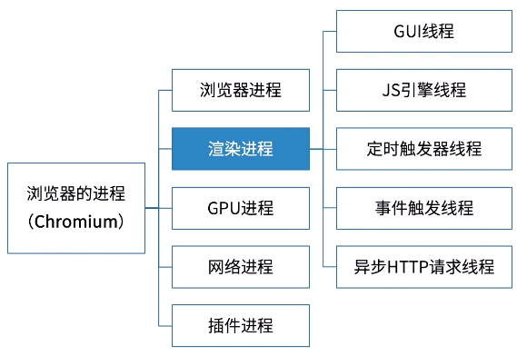
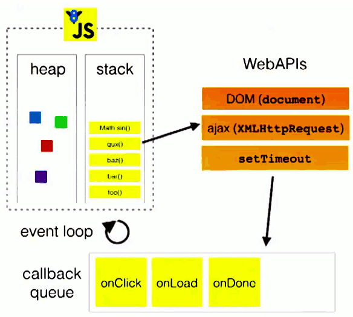
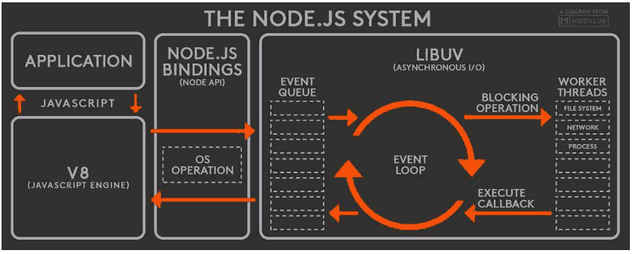
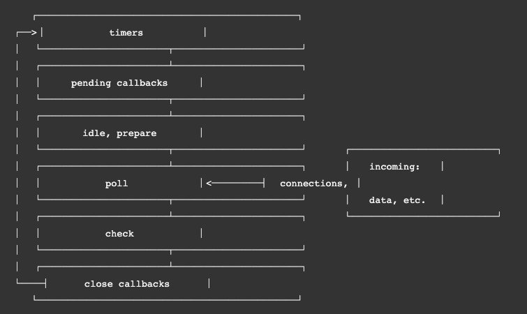
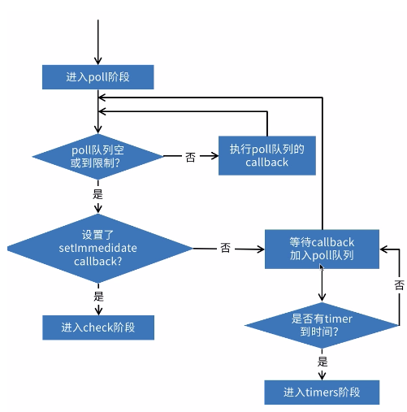

---
{
  "title": "JS异步机制",
}
---

## 浏览器环境(Chrome)的事件循环






- JS线程解析script
- Event Loop轮询线程将script中的定时器等耗时任务分配给对应线程处理
- 定时器等线程执行完后，Event Loop轮询线程将回调函数入任务队列
- JS线程执行栈空闲，查询消息队列，不空则执行

```js
setTimeout(function timeout(){console.log('timeout')},0)

window.addEventListener('click', function onclick(){console.log('onclick')})

var req = new XMLHttpRequest()
req.open('GET', 'www.baidu.com')
req.send()
req.onload = function onload(e){
  console.log('onload')
}; 

console.log('start')

//start
//timeout
//onload
//onclick
```

## 微任务和宏任务

- **微任务**：

> Promise
>
> process.nextTick(Node.js独有)
>
> Object.observe
>
> MutaionObserver

- **宏任务**：

> script (外层同步代码)
>
> setTimeout/setInterval
>
> setImmediate (Node.js独有)
>
> I/O
>
> UI事件
>
> postMessage

**注：**`微任务`优先级高于`宏任务`，`process.nextTick`优先级高于`promise`

```js
setTimeout(function tiemout1() {  
  setTimeout(function timeout2() {
    console.log('1  in timeout2');
  }, 10)
  console.log('3  in timeout1');
},0);

setTimeout(function timeout3() {  //添加到宏任务队列
  console.log('4  in timeout3');
}, 0)

Promise.resolve('5  promise resolve').then(console.log);  //添加到微任务队列， 微任务先于宏任务执行

//添加到微任务队列，执行完后将timeout添加到宏任务队列
Promise.reject('8  promise reject in timeout4').catch(
  (val) => setTimeout(
      function timeout4(){
          console.log(val)
      },0)); 


console.log('9  in main');

/* 
9  in main
5  promise resolve
3  in timeout1
4  in timeout3
8  promise reject in timeout4
1  in timeout2 
*/
```


## Nodejs环境的事件循环

> Node.js 有两种类型的线程：一个事件循环线程和多个工作线程。 
>
> 事件循环负责 JavaScript 回调和非阻塞 I/O，工作线程执行与 C++ 代码对应的、完成异步请求的任务，包括阻塞 I/O 和 CPU 密集型工作。 
>
> 这两种类型的线程一次都只能处理一个活动。 如果任意一个回调或任务需要很长时间，则运行它的线程将被阻塞。

### 宏观上




- v8引擎解析JavaScript脚本，执行同步代码。
- 解析后的代码，调用Node API，将异步任务插入到`微任务队列`或者`宏任务队列`中。
- 先执行微任务再执行宏任务的回调函数。`libuv`库负责Node API的执行。它将不同的任务分配给不同的线程，形成一个`Event Loop`（事件循环），以异步的方式将任务的执行结果返回给V8引擎。
- V8引擎再将结果返回给用户。

### 微观上



- `timers`：本阶段执行已经被 `setTimeout() 和 setInterval()` 调度的回调函数，简单理解就是由这两个函数启动的回调函数。
- `pending callbacks`：本阶段执行某些系统操作（如 TCP 错误类型）的回调函数。
- `idle、prepare`：仅系统内部使用。
- `poll`：检索新的 I/O 事件，执行与 I/O 相关的回调，其他情况 Node.js 将在适当的时候在此阻塞。这也是最复杂的一个阶段，所有的事件循环以及回调处理都在这个阶段执行，接下来会详细分析这个过程。
- `check`：setImmediate() 回调函数在这里执行，setImmediate 并不是立马执行，而是当事件循环 poll 中没有新的事件处理时就执行该部分，如下代码所示：

```js
console.log('outer');

setTimeout(() => {
  setTimeout(() => {
    console.log('setTimeout');
  }, 0);
  setImmediate(() => {
    console.log('setImmediate');
  });
}, 0);

//outer
//setImmediate
//setTimeout
```

- `close callbacks`：执行一些关闭的回调函数，如 `socket.on('close', ...)`



```js
setTimeout(function tiemout1() {  
  setTimeout(function timeout2() {
    console.log('1  in timeout2');
  }, 10)
  setImmediate(function immediate1(){console.log('2  immediate in timeout1');});
  //轮询阶段（poll)后的检查阶段（check)执行，添加到任务队列
  console.log('3  in timeout1');
},0);

Promise.resolve('4  promise resolve').then(console.log);  
//添加到微任务队列， 微任务先于宏任务执行

process.nextTick(function nextTick1() {         //添加到执行栈末尾
  process.nextTick(function nextTick2(){console.log('5  nextTick in nextTick2');});
  console.log('6  nextTick in nextTick1 ');
});

console.log('7  in main');

/* 
7  in main
6  nextTick in nextTick1
5  nextTick in nextTick2
4  promise resolve
3  in timeout1
2  immediate in timeout1
1  in timeout2 
*/
```


## Promise Queue限流队列，解决promise.all并发量太大的问题

```js
class PromiseQueue {
    constructor(options = {}) {
        this.concurrency = options.concurrency || 1;
        this._current = 0;
        this._list = [];
    }

    add(promiseFn) {
        this._list.push(promiseFn);
        this.loadNext();
    }

    loadNext() {
        if (this._list.length === 0 || this.concurrency === this._current) return;

        this._current++;
        const fn = this._list.shift();
        const promise = fn();
        promise.then(this.onLoaded.bind(this)).catch(this.onLoaded.bind(this));
    }

    onLoaded() {
        this._current--;
        this.loadNext();
    }
}

const q = new PromiseQueue();
[...Array(10).keys()].forEach(v => {
    q.add(() => new Promise((resolve,reject) => {
       setTimeout(() => {
           if(Math.random()>0.5){
               console.log(v);
               resolve();
           }
           else{
               console.log('fail');
               reject();
           }
       }, 1000);
    }));
});
```


## 使用 Promise 解决竞态条件

```js
//方法一：使用promise.reject
function getPromise(cb) {
  let _res, _rej;
  
  const promise = new Promise((res, rej) => {
    _res = res;
    _rej = rej;
    cb && cb(res,rej);
  });
    
  return {
    promise,
    abort: () => {
      _rej({
        name: "abort",
        message: "the promise is aborted",
        aborted: true,
      });
    }
  };
}
 
function runCb(resolve,reject){
    setTimeout(()=>{
        resolve('1111')
    },3000)
}
 
const { promise, abort } = getPromise(runCb);
promise.then(console.log).catch(e => {
  console.log(e);
});
 
//方法二：使用promise.race
//传入一个正在执行的promise
function getPromiseWithAbort(p){
    let obj = {};
    //内部定一个新的promise，用来终止执行
    let p1 = new Promise(function(resolve, reject){
        obj.abort = reject;
    });
    obj.promise = Promise.race([p, p1]);
    return obj;
}

var promise  = new Promise((resolve)=>{
 setTimeout(()=>{
  resolve('123')
 },3000)
})
 
var obj = getPromiseWithAbort(promise)
 
obj.promise.then(res=>{console.log(res)})

obj.abort('取消执行')
```


## 目标

- 用简单的几个例子讲解 JavaScript 的并发模型与事件循环
- 实现 Promise queue 以及简单列举应用场景
- 实现 Promise loop 以及简单列举应用场景
- 实现一个使用 Promise 解决竞态条件的例子


## 参考

> [并发模型与事件循环](https://developer.mozilla.org/zh-CN/docs/Web/JavaScript/EventLoop)
>
> [Philip Roberts: Help, I’m stuck in an event-loop](https://vimeo.com/96425312)
>
> [Asynchronous Recursion with Callbacks, Promises and Async.](https://blog.scottlogic.com/2017/09/14/asynchronous-recursion.html)
>
> [彻底明白 JS 线程](https://www.jianshu.com/p/8821c6432fe1)
>
> [Javascript异步编程的4种方法](https://www.ruanyifeng.com/blog/2012/12/asynchronous%EF%BC%BFjavascript.html)
>
> [JavaScript 运行机制详解：再谈Event Loop](http://www.ruanyifeng.com/blog/2014/10/event-loop.html)
>
> [Vue.nextTick 的原理和用途](https://segmentfault.com/a/1190000012861862)
>
> [深入：微任务与Javascript运行时环境](https://developer.mozilla.org/zh-CN/docs/Web/API/HTML_DOM_API/Microtask_guide/In_depth)
>
> [在 JavaScript 中通过 queueMicrotask() 使用微任务](https://developer.mozilla.org/zh-CN/docs/Web/API/HTML_DOM_API/Microtask_guide)
>
> [微任务（Microtask）](https://zh.javascript.info/microtask-queue)
>
> [事件循环：微任务和宏任务](https://zh.javascript.info/event-loop)
>
> [Promise 实现原理](https://scarletsky.github.io/2017/11/17/how-to-implement-promise-in-javascript/)
>
> [实现一个简单限流的 Promise 队列](https://scarletsky.github.io/2019/11/02/a-simple-throttle-promise-queue/)
>
> [化解使用 Promise 时的竞态条件](https://efe.baidu.com/blog/defusing-race-conditions-when-using-promises/)
>
> [promise+generator函数优化异步编程的底层原理分析](https://blog.51cto.com/u_15127622/3439282)
>
> [一文读懂JavaScript的并发模型和事件循环机制](https://segmentfault.com/a/1190000021123157)
>
> [setTimeout和setImmediate到底谁先执行，本文让你彻底理解Event Loop](https://juejin.cn/post/6844904100195205133)
>
> [Node环境哪种代码运行在事件轮询线程上？](https://nodejs.org/zh-cn/docs/guides/dont-block-the-event-loop/#redos)

